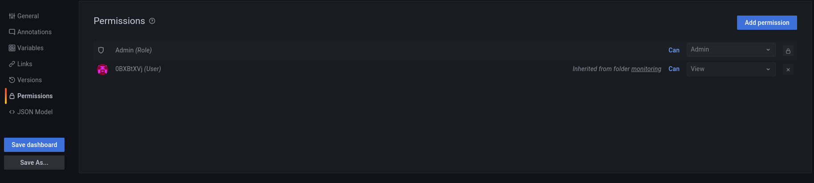

# Loki Log Dashboard 권한 설정 가이드
* 목적: Grafana를 활용하여 로그 조회 시 사용하는 log dashboard에 대한 권한을 네임스페이스 별로 설정하여 적용할 수 있다.

### Loki Log Dashboard에서 정의하는 Grafana user role
* Admin: 관리자 권한으로 loki datasource에 대한 설정, explore를 통한 로그 조회 및 사용자의 대시보드에 대한 접근 권한을 설정할 수 있는 role
* Editor: 로그 대시보드에 대한 read&write 권한을 가지고 있는 role
* Viewer: 로그 대시보드에 대한 read 권한을 가지고 있는 role

## Log Dashboard 사용자 접근 권한 설정
* 순서: 
    * Admin 계정으로 접속하여 Dashboard > Manage 에서 권한을 설정하려는 네임스페이스 폴더 내부의 dashboard를 클릭한다.
    * 조회 시간 설정 옆에 있는 톱니바퀴 아이콘을 클릭한 후 Settings에서 Permission을 클릭한다.
    * Add Permission을 클릭하여 특정 사용자 혹은 특정한 role을 가지고 있는 사용자 모두에게 대시보드에 대한 권한을 부여할 수 있다.
    
    
    
    
