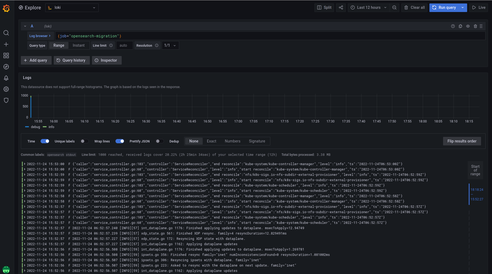

# Loki Data Migration 가이드
* 목적: Opensearch에 적재된 로그 데이터를 Logstash를 통해 Grafana Loki에 적재하여 이전 데이터를 Grafana를 통해 확인할 수 있다.

## 구성요소
* Logstash (docker.io/tmaxcloudck/logstash:opensearch-loki-plugin)
    * Logstash 7.16 version에 loki-output-plugin과 opensearch-input-plugin이 설치된 이미지

## Migration 진행 순서
1. Opensearch Stack에서 Opensearch를 제외한 나머지 파드들을 내린다.
2. Loki와 Promtail의 설치를 완료한다.
3. [loki-migration.yaml](../yaml/loki-migration.yaml)을 kubectl apply -f loki-migration.yaml로 실행한다.
4. Grafana UI에 Admin으로 접속하여 explore에서 LogQL로 {job="opensearch-migration"}으로 조회한다.

